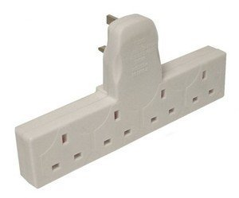

Powerstrip: A tool for prototyping Docker extensions
====================================================

At ClusterHQ we are participating in the `ongoing effort in the Docker community to add an extensions API to Docker <https://clusterhq.com/blog/docker-extensions/>`_.
You can join this effort at ``#docker-extensions`` on Freenode.

While this work is ongoing there is interest from the community to start prototyping extensions today.
`Enter Powerstrip. <https://clusterhq.com/blog/powerstrip-prototype-docker-extensions-today>`_

What is Powerstrip?
-------------------

Powerstrip is implemented as a configurable, pluggable HTTP proxy for the Docker API which lets you plug multiple Docker extension prototypes into the same Docker daemon.

For example, you can have a storage adapter (e.g. Flocker) running alongside a networking adapter (e.g. Weave), all playing nice with your choice of orchestration framework.

Crucially for the community, this immediately enables **composition** of prototypes of Docker extensions.

This is intended to allow quick prototyping, in order to figure out which integration points are needed in order to turn such prototypical adapters into `real Docker extensions <https://github.com/docker/docker/issues/9983>`_.

How it works
------------

Powerstrip works by implementing chained blocking webhooks to arbitrary Docker API calls.

This is inspired by https://github.com/docker/docker/issues/6982.

*A note on nomenclature:* we are calling the things that plug into the powerstrip "adapters" because it works with the metaphor, and may help disambiguate Powerstrip **adapters** from the Docker **extensions** they are prototyping.

Target audience
---------------

The target audience of this project is folks who to want to write Docker extensions, not end users.
See the Powerstrip adapters section below for a list of adapters that you can use with Docker.

Goal of project
---------------

It should eventually be possible to run, for example, a Powerstrip-enabled Docker Swarm with Flocker and Weave both loaded as extensions.

.. code:: yaml

    version: 1
    endpoints:
      "POST /*/containers/create":
        pre: [flocker, weave]
      "POST /*/containers/*/start":
        post: [weave]
    adapters:
      weave: http://weave/extension
      flocker: http://flocker/flocker-adapter

This example might allow an orchestration framework to move (reschedule) stateful containers while their Weave IP and Flocker volumes move around with them.

The Powerstrip configuration file can match any of the Docker API endpoints.

This enables you to modify any of the Docker behaviour and means Powerstrip will adapt easily to future changes in the Docker HTTP API.

Try it out
----------

Powerstrip ships as a Docker image, and adapters can be any HTTP endpoint, including other linked Docker containers.

Powerstrip expects Docker to have been reconfigured to listen on ``/var/run/docker.real.sock``, and to have ``/var/run`` on the host bind-mounted in at ``/host-var-run``.

Reconfigure Docker in this way: for example on Ubuntu edit ``/etc/default/docker`` with ``DOCKER_OPTS="-H unix:///var/run/docker.real.sock"`` and then run ``sudo service docker restart``.

Powerstrip will then create ``/var/run/docker.sock`` from the host's perspective (``/host-var-run/docker.sock`` from inside its container) and normal Docker tools should carry on working as normal.

`Slowreq <https://github.com/clusterhq/powerstrip-slowreq>`_ is a trivial Powerstrip adapter (container) which adds a 1 second delay to all create commands.

If you are using ``boot2docker``, who knows. XXX ???

Try it out like this (assuming logged into an Ubuntu Docker host).

.. code:: sh

    $ cd ~/
    $ mkdir powerstrip-demo
    $ cat > powerstrip-demo/adapters.yml <<EOF
    version: 1
    endpoints:
      "POST /*/containers/create":
        pre: [slowreq]
    adapters:
      slowreq: http://slowreq/slowreq-adapter
    EOF

    $ sudo DOCKER_HOST="unix:///var/run/docker.real.sock" \
           docker run -d --name powerstrip-slowreq \
               --expose 80 \
               clusterhq/powerstrip-slowreq:v0.0.1
    $ sudo DOCKER_HOST="unix:///var/run/docker.real.sock" \
           docker run -d --name powerstrip \
               -v /var/run:/host-var-run \
               -v $PWD/powerstrip-demo/adapters.yml:/etc/powerstrip/adapters.yml \
               --link powerstrip-slowreq:slowreq \
               clusterhq/powerstrip:unix-socket # XXX change this to v0.0.2 when releasing

    # Note how the second command takes a second longer than the first.
    $ time sudo DOCKER_HOST="unix:///var/run/docker.sock.real" \
                docker run ubuntu echo hello
    $ time sudo docker run ubuntu echo hello

**Issues:** If you are using ``SELinux`` and having some issues, disable it or run the following commands:

.. code:: sh

    $ sudo grep docker /var/log/audit/audit.log | audit2allow -M mypol
    $ sudo semodule -i mypol.pp

Powerstrip adapters
-------------------

This is a list of current and upcoming Powerstrip adaptors.  Submit a pull request to add yours:

* powerstrip-flocker: portable data volumes for Docker containers - https://github.com/clusterhq/powerstrip-flocker
* powerstrip-weave: use Weave for container networking - https://github.com/binocarlos/powerstrip-weave

Read on for detailed info on writing your own adapter.

Writing an adapter
------------------

A adapter is just a single HTTP POST API endpoint.
Use your favourite framework and language to write it.

Pre-hook adapter endpoints receive POSTs like this
~~~~~~~~~~~~~~~~~~~~~~~~~~~~~~~~~~~~~~~~~~~~~~~~~~

Pre-hooks get called when the client has sent a request to the proxy, but before that request is passed through to the Docker daemon.
This gives the adapter the opportunity to modify or delay the request.

.. code::

    POST /adapter HTTP/1.1
    Content-type: application/json
    Content-length: ...

    {
        PowerstripProtocolVersion: 1,
        Type: "pre-hook",
        ClientRequest: {
            Method: "POST",
            Request: "/v1.16/container/create",
            Body: "{ ... }" or null
        }
    }

And they respond with:

.. code::

    HTTP 200 OK
    Content-type: application/json

    {
        PowerstripProtocolVersion: 1,
        ModifiedClientRequest: {
            Method: "POST",
            Request: "/v1.16/container/create",
            Body: "{ ... }" or null
        }
    }

So that, for example, they can rewrite a GET request string, or modify the JSON in a POST body.

Alternatively, pre-hooks can respond with an HTTP error code, in which case the call is never passed through to the Docker daemon, and instead the error is returned straight back to the client.

Pre-hooks must not change the scope of which endpoint is being matched - rewriting the Request should only be used for modifying GET arguments (e.g. after a '?' in the URL).

Post-hook adapter endpoints receive POSTs like this
~~~~~~~~~~~~~~~~~~~~~~~~~~~~~~~~~~~~~~~~~~~~~~~~~~~

Post-hooks get called after the response from Docker is complete but before it has been sent back to the client.
Both the initial request and the Docker response are included in the POST body.

Plugins thus get a chance to modify or delay the response from Docker to the client.

.. code::

    POST /adapter HTTP/1.1

    {
        PowerstripProtocolVersion: 1,
        Type: "post-hook",
        ClientRequest: {
            Method: "POST",
            Request: "/v1.16/containers/create",
            Body: "{ ... }"
        }
        ServerResponse: {
            ContentType: "text/plain",
            Body: "{ ... }" response string
                            or null (if it was a GET request),
            Code: 404
        }
    }

The adapter responds with:

.. code::

    {
        PowerstripProtocolVersion: 1,
        ModifiedServerResponse: {
            ContentType: "application/json",
            Body: "{ ... }",
            Code: 200
        }
    }

This gives the post-hook a chance to convert a Docker error into a success if it thinks it can.

Chaining
~~~~~~~~

Both pre- and post-hooks can be chained: the response from the N'th hook is passed in as the request to the N+1'th in list order according to the YAML configuration.

If any hook returns an HTTP error response, the rest of the chain is cancelled, and the error returned to the client.
You can think of this like `Twisted Deferred chains <http://twistedmatrix.com/documents/13.0.0/core/howto/defer.html#auto3>`_ where hooks are like callbacks.
The exception to this is when the Docker API returns an error: the post-hooks are still run in that case, because we thought adapter authors would like to know about Docker error messages.

Defining Endpoints
------------------

Endpoints are defined using UNIX shell-like globbing.
The request ``POST /v1.16/container/create`` would be matched by all of the following endpoint definitions:

* ``POST /v1.16/containers/create``
* ``POST /v1*/containers/create``
* ``POST /*/containers/create``
* ``POST /*/*/create``
* ``* /*/containers/create``
* ``POST /v[12]/containers/create``

Note: Query arguments are stripped for matching purposes.

Any of the Docker endpoints can be matched - so for example the following routes are perfectly valid:

* ``POST /*/containers/create``
* ``POST /*/containers/*/start``
* ``POST /*/containers/*/stop``
* ``POST /*/containers/*/kill``

A useful resource when defining your endpoints is the `Docker remote API documentation <https://docs.docker.com/reference/api>`_

Limitations
-----------

Powerstrip does not support, and will silently skip over certain types of hooks in the following cases:

* pre-hooks for request bodies with content-types other than ``application/json``, such as build contexts POSTed in the ``build`` API call.
* post-hooks for responses with content-type ``application/vnd.docker.raw-stream``, such as "hijacked" responses in the ``attach`` API call.

For responses that are streamed back from the Docker daemon without proper framing (such as ``build`` and ``pull`` API call responses):

* if post-hooks are not added:

  * responses will be streamed to the client as they come in from the Docker daemon.

* otherwise, if post-hooks are added, then:

  * responses will be buffered and then delivered to the post-hook chain as a single body.

Recommended deployment
----------------------

For now, Powerstrip does not support TLS, but given that it should only be used for prototyping in local development environments, that's OK.

It's recommended that adapters run in containers that are linked (with Docker links) to the proxy container.
Plugins should listen on port 80.

Then you can just specify the URL using e.g. http://adapter/, assuming "adapter" is the link alias.
(See example under "Try it out").

Contributing
------------
We'd love your help with Powerstrip.
If you have any questions or need help, besides filing a GitHub issue with feature requests or bug reports you can also join us on the #clusterhq or #docker-extensions channel on the irc.freenode.net IRC network.

We plan to do CI with from https://drone.io/ for unit tests.
Or maybe Travis-CI.
Integration tests will exist but only get run manually for now.

Possible fates for a request
----------------------------

There are a few different paths that an HTTP request can take.

Here are some of them:

* Client req => Plugin pre-hook returns OK => Docker => Plugin post-hook => Client response
* Client req => Plugin pre-hook returns error code => error response to client (don't pass through request to Docker)
* Client req => Plugin pre-hook => Docker => Error response from Docker to adapter post-hook => Pass through error response to client
* Client req => Plugin pre-hook => Docker => Plugin post-hook => error response to client

Possible improvements
=====================

* A Continue response argument could be added to allow chain cancellation with a non-error response.
* Verbose logging (to stdout) as an optional argument/yaml configuration flag, to help adapter authors debugging adapters.

  * Define the logging/traceability story (adapters and powerstrip log to stdout?).

* A public list of all known Powerstrip hooks (GitHub links + Docker Hub names).
* Version the webhooks and the configuration.
* Publish standard testing framework for adapters.
* Expose headers as well as (instead of) just content-type.
  For both pre and post-hooks.
* Run all the hooks in case of an error condition, do give them a chance to unwind things.
* Have an explicit "unwinder" hook-type for pre-hooks, to differentiate error-handling post-hooks from regular post-hooks.

Changelog
=========

v0.0.2:

* Add integration tests against real Docker for ``run``, ``build`` and ``pull``, fix various bugs exposed therein.
* In particular, fix docker ``attach``, streaming responses when there are no post-hooks, GET requests, skip pre-hooks with ``application/tar`` handling, stdin handling for ``attach``.

v0.0.1:

* Initial release

Additional Adapter Ideas
========================

* A post hook for containers => start that will block until the container is fully connected to the weave bridge
* A pre hook for containers => create that will inject ENV variables loaded from `consul <https://github.com/hashicorp/consul>`_ or `etcd <https://github.com/coreos/etcd>`_
* A post hook for containers => {start,stop} that will update `consul <https://github.com/hashicorp/consul>`_ or `etcd <https://github.com/coreos/etcd>`_ with the containers exposed endpoints

License
=======

Copyright 2015 ClusterHQ, Inc

Licensed under the Apache License, Version 2.0 (the "License"); you may not use this file except in compliance with the License.  You may obtain a copy of the License at

   http://www.apache.org/licenses/LICENSE-2.0

Unless required by applicable law or agreed to in writing, software distributed under the License is distributed on an "AS IS" BASIS, WITHOUT WARRANTIES OR CONDITIONS OF ANY KIND, either express or implied.  See the License for the specific language governing permissions and limitations under the License.
